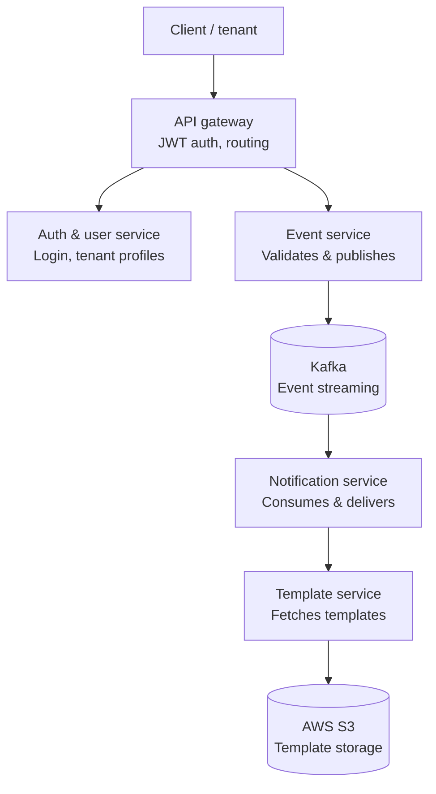

# NotifyHub

A multi-tenant notification platform built with microservices. Companies (tenants) register on the platform, configure their notification channels, and trigger notifications through a simple API call. The platform handles routing, template management, and delivery.

## Tech Stack

- Java 17, Spring Boot 3
- Spring Cloud Gateway (MVC), Netflix Eureka, Spring Cloud LoadBalancer
- Resilience4j (Circuit Breaker, Retry, Time Limiter)
- Apache Kafka
- MySQL
- Docker, Docker Compose
- AWS S3, EC2, IAM
- JWT (Spring Security)

## Architecture

7 Spring Boot services: 5 business microservices with their own MySQL databases, an API Gateway as the single public entry point, and a Eureka discovery server. Services register with Eureka on startup and are resolved by name rather than fixed host:port.

| Service | Responsibility |
|---------|---------------|
| api-gateway | Single entry point, JWT validation, request routing |
| discovery-server | Eureka service registry |
| auth-service | Tenant registration, login, JWT issuance |
| user-service | Tenant profiles, subscriptions |
| event-service | Receives trigger requests, publishes to Kafka |
| notification-service | Consumes Kafka events, sends email or webhook |
| template-service | Stores and retrieves HTML templates via AWS S3 |



## Authentication

All endpoints except `/api/auth/register` and `/api/auth/login` require a JWT token, validated at the Gateway before any request reaches a downstream service.

```
Authorization: Bearer <token from /api/auth/login>
```

The Gateway extracts the tenant identity from the verified token and forwards it downstream as an `X-Tenant-Id` header — services trust this header, not any tenant ID supplied directly by the client.

## Running Locally

### Setup

1. Clone the repo
```bash
git clone https://github.com/Kalyan-Mandhula-Dev/NotifyHub
cd NotifyHub
```

2. Create a `.env` file in the root (never committed to git)
```env
MYSQL_ROOT_PASSWORD=your-password
JWT_SECRET=your-secret-key-string
JWT_EXPIRATION_MS=86400000
MAIL_USERNAME=your-email@gmail.com
MAIL_PASSWORD=your-gmail-app-password
AWS_REGION=ap-south-1
AWS_ACCESS_KEY=your-access-key
AWS_SECRET_KEY=your-secret-key
AWS_S3_BUCKET=notifyhub-templates
EUREKA_SERVER_URL=http://discovery-server:8761/eureka/
```

3. Build all services to create .jar files
```bash
cd api-gateway && mvn clean package -DskipTests && cd ..
cd discovery-server && mvn clean package -DskipTests && cd ..
cd auth-service && mvn clean package -DskipTests && cd ..
cd user-service && mvn clean package -DskipTests && cd ..
cd event-service && mvn clean package -DskipTests && cd ..
cd notification-service && mvn clean package -DskipTests && cd ..
cd template-service && mvn clean package -DskipTests && cd ..
```

4. Start everything
```bash
docker compose up --build
```

All services, Eureka, MySQL, Kafka, and Zookeeper start with a single command.

### Service Ports

| Service | URL | Publicly Accessible |
|---------|-----|----------------------|
| api-gateway | http://localhost:8080 | Yes — only public entry point |
| discovery-server | http://localhost:8761 | Local/dev only |
| auth-service | internal only (8081) | No |
| user-service | internal only (8082) | No |
| event-service | internal only (8083) | No |
| notification-service | internal only (8084) | No |
| template-service | internal only (8085) | No |
| Kafka | localhost:9092 | No |

All API requests go through `http://localhost:8080` (or `http://<ec2-ip>:8080` in deployment). Individual services are not reachable directly.

---

## API Reference

All requests below go through the Gateway at port 8080. Every endpoint except register/login requires the `Authorization: Bearer <token>` header.

### Auth Service

| Method | Endpoint | Description |
|--------|----------|-------------|
| POST | /api/auth/register | Register new tenant (no auth required) |
| POST | /api/auth/login | Login and get JWT token (no auth required) |
| GET | /api/auth/validate | Validate JWT token |

**Register**

*Request*
```json
POST /api/auth/register
{
  "companyName": "Swiggy",
  "email": "tech@swiggy.com",
  "password": "Swiggy@123"
}
```

*Response*
```json
{
  "token": "eyJhbGciOiJIUzI1NiJ9...",
  "tenantId": "f47ac10b-58cc-4372-a567-0e02b2c3d479",
  "email": "tech@swiggy.com",
  "message": "Registration Successful !!"
}
```

**Validate**
```
GET /api/auth/validate
Authorization: Bearer <token>
```

---

### User Service

| Method | Endpoint | Description |
|--------|----------|-------------|
| POST | /api/users/tenants | Create tenant profile |
| GET | /api/users/tenants/{id} | Get tenant |
| PUT | /api/users/tenants/{id} | Update tenant |
| DELETE | /api/users/tenants/{id} | Deactivate tenant |
| POST | /api/users/subscriptions | Add email or webhook subscription |
| GET | /api/users/subscriptions/{tenantId} | Get subscriptions |
| DELETE | /api/users/subscriptions/{id} | Remove subscription |

---

### Event Service

| Method | Endpoint | Description |
|--------|----------|-------------|
| POST | /api/events/trigger | Trigger a notification event |
| GET | /api/events/{tenantId} | Get all events for a tenant |

**Trigger Event**
```json
POST /api/events/trigger
Authorization: Bearer <token>
{
  "eventType": "order.placed",
  "channel": "EMAIL",
  "recipient": "kalyan@gmail.com",
  "payload": {
    "orderId": "SWG123",
    "restaurantName": "ABC Restaurant",
    "amount": 310
  }
}
```
`tenantId` is no longer sent in the body — the Gateway injects it from the verified token as `X-Tenant-Id`.

Returns `202 Accepted` immediately. Notification is processed asynchronously via Kafka.

**Channel options:** `EMAIL`, `WEBHOOK`

**Event status values:**

| Status | Meaning |
|--------|---------|
| RECEIVED | Saved to DB, not yet sent to Kafka |
| PUBLISHED | Successfully published to Kafka |
| FAILED | Kafka publish failed |

**Kafka Topics**

| Topic | Purpose |
|-------|---------|
| notification.email.send | Email events |
| notification.webhook.send | Webhook events |

---

### Notification Service

Notification service has no trigger endpoint — all processing is Kafka-driven. REST endpoints are read-only.

| Method | Endpoint | Description |
|--------|----------|-------------|
| GET | /api/notifications/history/{tenantId} | Delivery history |
| GET | /api/notifications/stats/{tenantId} | Delivery stats |

**Stats Response**
```json
{
  "tenantId": "f47ac10b-58cc-4372-a567-0e02b2c3d479",
  "totalSent": 120,
  "totalFailed": 3,
  "totalPending": 0
}
```

**Delivery status values:**

| Status | Meaning |
|--------|---------|
| PENDING | Consumed from Kafka, processing started |
| SENT | Email or webhook delivered successfully |
| FAILED | Delivery failed — errorMessage populated |

---

### Template Service

| Method | Endpoint | Description |
|--------|----------|-------------|
| POST | /api/templates | Upload HTML template (multipart/form-data) |
| GET | /api/templates/resolve | Get template by tenantId and eventType |
| GET | /api/templates/tenant/{tenantId} | List all templates for a tenant |
| DELETE | /api/templates/{templateId} | Delete a template |

**Upload Template (Postman — form-data)**
```
tenantId      → f47ac10b-58cc-4372-a567-0e02b2c3d479
eventType     → order.placed
templateName  → order-confirmation
file          → order-confirmation.html  (file type)
```

**Resolve Template**
```
GET /api/templates/resolve?tenantId={tenantId}&eventType=order.placed
```

Returns the full HTML content of the template fetched from AWS S3.

**Sample template file**
```html
<html>
<body>
  <h2>Order Confirmation</h2>
  <p>Order ID: {{orderId}}</p>
  <p>Restaurant: {{restaurantName}}</p>
  <p>Amount: ₹{{amount}}</p>
</body>
</html>
```

`{{key}}` placeholders are replaced with values from the event payload before sending.

If template-service is unreachable or no template is found, notification-service falls back to a plain HTML table — delivery never fails because of a missing or unavailable template.

---

## How It All Works Together

```
1. Example tenant: Swiggy

2. Swiggy registers → api-gateway (open route, no token needed) →
   auth-service creates credentials, calls user-service to create tenant profile

3. Swiggy subscribes to an event EMAIL -> user-service

4. Swiggy uploads an HTML template → template-service
   stores file in AWS S3, saves metadata in template_db

5. Swiggy triggers an event (order.placed) → api-gateway validates JWT,
   injects tenantId as a header, forwards to event-service →
   validates the tenant and subscriptions, saves to event_db,
   publishes to Kafka topic → returns 202 immediately

6. notification-service picks up the Kafka message,
   fetches the template from template-service (from S3),
   sends the email to the customer,
   logs the result (SENT or FAILED) in notification_db
```

---

## Key Design Decisions

**API Gateway + Centralized Auth**

A Spring Cloud Gateway (MVC-based) is the single public entry point for all 5 services. It validates JWTs once, in one place, instead of duplicating auth logic across services, and injects the verified tenant identity downstream as a trusted header — so a tenant can never spoof another tenant's ID by editing a request body.

**Service Discovery**

All services register with a Eureka server on startup and are looked up by name instead of hardcoded `host:port`. This means a service can be scaled to multiple instances, or moved to a new host, with zero configuration changes anywhere else in the system.

**Fault Tolerance with Resilience4j**

The `notification-service → template-service` call is wrapped with Resilience4j: 3 retry attempts (500ms apart) for transient failures, a 2-second timeout to prevent hung threads, and a circuit breaker that opens after a 50% failure rate over a 10-call window to stop hammering a dead dependency. On exhausted retries, it falls back to a plain HTML table instead of failing the notification. This same pattern is established and intended to extend to the other inter-service calls (`auth-service → user-service`, `event-service → user-service`) going forward.

**Transactional Outbox Pattern**

Event-service saves the event and an outbox record in the same database transaction. A scheduler retries any unpublished records every 30 seconds. This ensures no event is lost even if Kafka is temporarily down.

**Manual Kafka Acknowledgement**

Notification-service only acknowledges a Kafka message after the notification is successfully delivered. If delivery fails, the message is not acknowledged and Kafka redelivers it.

**Service-owned Databases**

Each service has its own database. No service queries another service's database directly — data is accessed only through APIs.

---

## Database

| Service | Database |
|---------|----------|
| auth-service | auth_db |
| user-service | user_db |
| event-service | event_db |
| notification-service | notification_db |
| template-service | template_db |

---

## AWS Setup

- **S3 bucket:** `notifyhub-templates` (ap-south-1, private access)
- **IAM policy:** template-service IAM user has `s3:GetObject`, `s3:PutObject`, `s3:DeleteObject`, `s3:ListBucket` on the bucket only
- **EC2 deployment:** IAM Role attached directly to the EC2 instance — no access keys stored anywhere on the server
- **S3 key structure:** `{tenantId}/{eventType}/{templateName}.html`

---

## Deployment

Deployed on AWS EC2 (ap-south-1). All services run via Docker Compose on a single instance. Only the Gateway is publicly reachable.

| Service | URL |
|---------|-----|
| api-gateway | http://<ec2-ip>:8080 |
| discovery-server | internal only |
| auth-service | internal only |
| user-service | internal only |
| event-service | internal only |
| notification-service | internal only |
| template-service | internal only |

EC2 security group: only ports 8080 (API) and 22 (SSH) open inbound.

Import `NotifyHub_Postman_API_Collection.json` from the repo to test all endpoints — base URL should point at the Gateway (`:8080`), not individual service ports.
